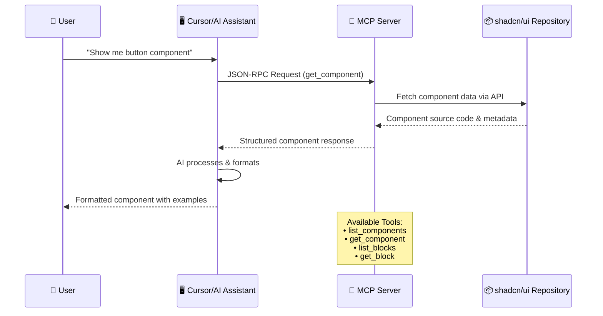

# Shadcn MCP Server

A Model Context Protocol (MCP) server that provides AI assistants with direct access to shadcn/ui components and blocks. This server enables AI assistants like Claude (via Cursor) to fetch real-time component source code, documentation, and implementation examples.

## 🎯 What is this?

The **Shadcn MCP Server** bridges the gap between AI assistants and the shadcn/ui component library. Instead of relying on potentially outdated training data, AI assistants can now fetch the latest component implementations directly from the shadcn/ui repository.

### Key Benefits

- ✅ **Always Up-to-Date**: Fetches components directly from the official shadcn/ui repository
- ✅ **Complete Implementation**: Get full source code, dependencies, and usage examples
- ✅ **AI-Powered Development**: Let AI assistants help you implement components correctly
- ✅ **Time-Saving**: No more manual copying from docs or searching for examples

## 🔄 How It Works



## 🚀 Quick Start

### Prerequisites

- **Node.js** ≥ 22.0.0
- **pnpm** (recommended) or npm
- **Cursor IDE** (for AI integration)
- **Recommended**: GitHub Personal Access Token (for higher rate limits)

### 1. Installation

```bash
# Clone the repository
git clone https://github.com/yourusername/shadcn-mcp-server.git
cd shadcn-mcp-server

# Install dependencies
pnpm install

# Build the project
pnpm run build
```

### 2. Cursor Configuration

#### Option A: Automatic Setup (Recommended)

```bash
# Run the setup script
node scripts/test-cursor.js
```

This script will:

- Generate the correct Cursor configuration
- Create a wrapper script for your system
- Provide step-by-step instructions

#### Option B: Manual Configuration

1. **Find your Cursor settings:**

   - **macOS**: `~/Library/Application Support/Cursor/User/globalStorage/cursor-settings.json`
   - **Windows**: `%APPDATA%\Cursor\User\globalStorage\cursor-settings.json`
   - **Linux**: `~/.config/Cursor/User/globalStorage/cursor-settings.json`

2. **Add the MCP server configuration:**

```json
{
  "mcpServers": {
    "shadcn": {
      "command": "node",
      "args": ["/absolute/path/to/shadcn-mcp-server/dist/index.js"],
      "env": {
        "GITHUB_TOKEN": "your_github_token_here"
      }
    }
  }
}
```

3. **Restart Cursor** completely (quit and reopen)

### 3. Verify Installation

Open Cursor and try these commands with Claude:

```
"List all available shadcn components"
"Show me the button component source code"
"Get the dashboard-01 block implementation"
"What shadcn blocks are available?"
```

If configured correctly, Claude will fetch real-time data from the shadcn/ui repository!

## 🧪 Testing & Development

### Local Testing

```bash
# Run unit tests
pnpm test

# Test MCP server integration
pnpm run test:mcp

# Manual testing (interactive)
pnpm run test:manual
```

### Development Mode

```bash
# Development with hot reload
pnpm run dev

# Watch tests
pnpm run test:watch

# Clean build artifacts
pnpm run clean
```

## 🛠️ Available Tools

| Tool              | Description                                           | Example Usage                           |
| ----------------- | ----------------------------------------------------- | --------------------------------------- |
| `list_components` | List all available shadcn/ui components               | "What shadcn components are available?" |
| `get_component`   | Get source code and metadata for a specific component | "Show me the button component"          |
| `list_blocks`     | List all available shadcn/ui blocks                   | "What shadcn blocks can I use?"         |
| `get_block`       | Get a complete shadcn/ui block implementation         | "Get the dashboard-01 block"            |

## 💡 Usage Examples

### Basic Component Usage

**User**: "Show me how to create a button with different variants"

**Claude with MCP**: Will fetch the latest button component and provide:

- Complete source code
- All available variants (default, destructive, outline, secondary, ghost, link)
- Size options (sm, default, lg, icon)
- Usage examples with proper imports
- Accessibility features

### Advanced Block Implementation

**User**: "I need a complete dashboard layout"

**Claude with MCP**: Will fetch dashboard blocks and provide:

- Full implementation code
- Required dependencies
- Component breakdown
- Styling and layout structure

### Real-time Component Discovery

**User**: "What new components were added to shadcn recently?"

**Claude with MCP**: Will fetch the current component list and highlight:

- All available components
- Brief descriptions
- Categorization

## 🔧 Configuration Options

### Environment Variables

Create a `.env` file in the project root:

```env
# Optional: GitHub token for higher rate limits
GITHUB_TOKEN=ghp_your_token_here

# Optional: Enable debug logging
DEBUG=true

# Optional: Set environment
NODE_ENV=development
```

### GitHub Token Setup (Optional but Recommended)

1. Go to [GitHub Settings > Developer settings > Personal access tokens](https://github.com/settings/tokens)
2. Generate a new token (classic)
3. **No special permissions needed** - public repository access is sufficient
4. Add the token to your environment variables

**Benefits of using a token:**

- Higher rate limits (5,000 requests/hour vs 60/hour)
- More reliable for heavy usage
- Better performance

## 📦 Deployment Options

### Option 1: Local Development (Recommended)

Perfect for personal use and development:

```bash
pnpm run build
# Use the path in Cursor config: /path/to/dist/index.js
```

### Option 2: Global npm Installation

```bash
# Publish your fork (update package.json first)
npm publish --access public

# Install globally
npm install -g @yourusername/shadcn-mcp-server

# Use in Cursor
"command": "shadcn-mcp-server"
```

### Option 3: Direct Git Installation

```bash
npm install -g git+https://github.com/yourusername/shadcn-mcp-server.git
```

## 🎯 Architecture Overview

```
shadcn-mcp-server/
├── index.ts                 # Main MCP server setup
├── services/
│   └── shadcn-service.ts   # Core component fetching logic
├── types/
│   └── shadcn.ts           # TypeScript definitions
├── utils/
│   └── logger.ts           # Logging configuration
└── scripts/
    ├── test-cursor.js      # Cursor setup automation
    └── test-mcp.js         # MCP protocol testing
```

### Key Components

- **MCP Server**: Handles JSON-RPC communication with Cursor/Claude
- **Shadcn Service**: Fetches components and blocks from GitHub API
- **Type Safety**: Full TypeScript support for all operations
- **Error Handling**: Graceful degradation and informative error messages
- **Caching**: Smart caching to reduce API calls and improve performance

## 🐛 Troubleshooting

### Common Issues

#### "MCP server not found"

- Verify the absolute path in your Cursor configuration
- Ensure the project is built (`pnpm run build`)
- Check that Node.js is in your system PATH

#### "Rate limit exceeded"

- Add a GitHub token to your environment variables
- The server will automatically use the token for authenticated requests

#### "Component not found"

- Check component name spelling (use `list_components` first)
- Some components may have different names than expected

#### "Cursor not recognizing MCP server"

- Restart Cursor completely (quit and reopen)
- Verify JSON syntax in your Cursor configuration
- Check the MCP server logs for errors

### Debug Mode

Enable detailed logging:

```bash
DEBUG=true node dist/index.js
```

Or set in your Cursor configuration:

```json
{
  "mcpServers": {
    "shadcn": {
      "command": "node",
      "args": ["/path/to/dist/index.js"],
      "env": {
        "DEBUG": "true"
      }
    }
  }
}
```

## 🤝 Contributing

1. **Fork** the repository
2. **Create** a feature branch (`git checkout -b feature/amazing-feature`)
3. **Make** your changes
4. **Add** tests (`pnpm test`)
5. **Run** the full test suite (`pnpm run test:mcp`)
6. **Commit** your changes (`git commit -m 'Add amazing feature'`)
7. **Push** to the branch (`git push origin feature/amazing-feature`)
8. **Open** a Pull Request

### Development Guidelines

- Follow TypeScript best practices
- Add tests for new functionality
- Update documentation for API changes
- Ensure all tests pass before submitting

## 📄 License

MIT License - see [LICENSE](LICENSE) file for details.

---

**Made with ❤️ for the shadcn/ui and AI development community**

_If this project helps you build better UIs faster, consider giving it a ⭐!_
